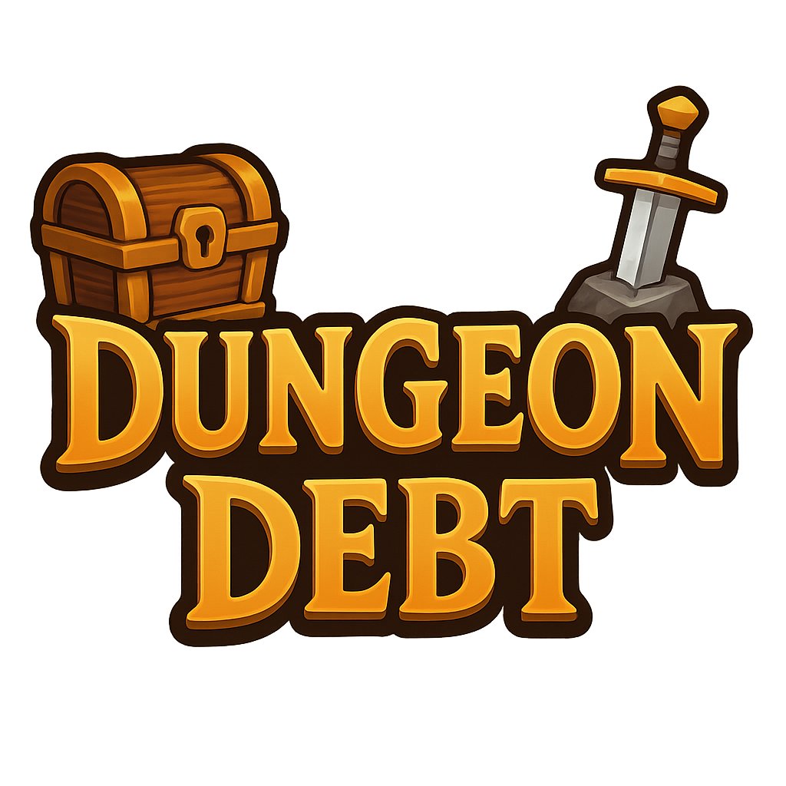

<html>
<body>

# **Team 37 Product Name**
### **`Dungeon Debt`**

# Information About Team and Product

# Team Members
<table>
    <tr>
      <th></th>
      <th>Name</th>
      <th>Title</th>
      <th>Socials</th>
    </tr>
    <tr>
      <td></td>
      <td>Berke Batı</td>
      <td>Scrum Master</td>
      <td>
        
        
        
      </td>
    </tr>
    <tr>
      <td></td>
      <td>Mehmet Akif Genç</td>
      <td>Product Owner</td>
      <td>
        
        
        
      </td>
    </tr>
    <tr>
      <td></td>
      <td>Esma Nisa Orta</td>
      <td>Developer</td>
      <td>
        
        
      </td>
    </tr>
    <tr>
      <td></td>
      <td>Fatma Sude Güler</td>
      <td>Developer</td>
      <td>
        
        
      </td>
    </tr>
    <tr>
      <td></td>
      <td>Seferhan Kaya</td>
      <td>Developer</td>
      <td>
        
        
        
      </td>
    </tr>
  </table>
  
  # Product Description
  Dungeon Debt is a single-player adventure RPG game. When we entered a forbidden dungeon, we were taken hostage by a Mage Monster called "The Merchant". Our adventurer must kill enemies and open chests to collect loot and sell it to the merchant to pay off our debt. With the portal created by The Merchant, we can travel to the dungeon or the labyrinth. In these locations, you can slay skeletons, collect keys to unlock treasure rooms, open many chests, and trigger hidden doors.
  
  # Product Features
  * 3D
  * Single-player
  * Looter
  * Adventure RPG

 # Target Audience
 * 7+
 * Single Player Gamers
 * Fantasy, Adventure RPG, and Looter Enjoyers
 * PC Gamers

    
<h1>Sprint 1</h1>

  

    
<h3>Sprint 1 - Game Screenshots</h3>

  <table style="width: 100%;">
    <tr>
      <td colspan="2" style="text-align: center;"><h2>Main Menu</h2></td>
    </tr>
    <tr>
      <td style="width: 25%;"></td>
      <td style="width: 25%;"></td>
    </tr>
    <tr>
      <td colspan="3" style="text-align: center;"><h2>Character</h2></td>
    </tr>
    <tr>
      <td style="width: 25%;"></td>
      <td style="width: 25%;"></td>
      <td style="width: 25%;"></td>
    </tr>
    <tr>
      <td colspan="2" style="text-align: center;"><h2>Inventory</h2></td>
    </tr>
    <tr>
      <td style="width: 25%;"></td>
      <td style="width: 25%;"></td>
    </tr>
  </table>
  
   

  

    
<h3>Sprint 1 - Sprint Board Update Screenshots</h3>

    
    
    
    

  

  

    
<h3>Sprint 1 - General Tasks and Completion Rates</h3>

    
  

  - **Sprint Notes**:
    - Decided to use `WhatsApp` and `Google Meet` for general communication and meetings.
    - Decided to use `Notion` to visualise the sprint progress.
    - Came up with the project idea.
    - Decided on a majority of asset packs to use.
    - Divided the tasks among members based on their skill level and their schedule.
  - **Expected point completion within Sprint:** 50 points
  - **Actual point completion within Sprint:** 63 points
  - **Point Completion Logic:** Every general task has some sub-tasks. We point tasks from 1 to 10 based on how hard or time-consuming they are. Each member gets a task based on their schedule and skill.

  - **Sprint Review:**
    - Lost a lot of valuable time during the first week of the boot camp while trying to build a system and came up with the project idea.
    - Mehmet made progress on the character with the controller and animations.
    - Sude made progress on the inventory system.
    - Berke tested the assets and drafted map ideas.
    - Overall, scheduling conflicts and communication problems cost us a bunch of valuable time, which turned into smaller progress. 

  - **Sprint Retrospective:**
    - We need to communicate more with each other.
    - We need to be more responsible.
    - We must adapt to the `Notion` interface.
    - We need to complete as many tasks as we can to make up for our loss in Sprint 1.

  - **Main Menu Development:**
    - Three UI panels (Main, Settings, Pause) have been created and controlled dynamically.
    - Play button loads scenes using Unity's SceneManager.
    - Continue button enabled conditionally via PlayerPrefs; currently loads placeholder scenes.
    - Scene transitions tested using placeholder scenes; all necessary scenes added to Build Settings.
    - Settings panel UI is ready, but audio/resolution controls are pending.
    - Pause menu not yet implemented; planned for upcoming sprints.

  

    
<h1>Sprint 2</h1>

  

    
<h3>Sprint 2 - Game Screenshots</h3>

  <table style="width: 100%;">
    <tr>
      <td colspan="2" style="text-align: center;"><h2>Main Menu</h2></td>
    </tr>
    <tr>
      <td style="width: 25%;"></td>
      <td style="width: 25%;"></td>
    </tr>
    <tr>
      <td colspan="3" style="text-align: center;"><h2>Character</h2></td>
    </tr>
    <tr>
      <td style="width: 25%;"></td>
      <td style="width: 25%;"></td>
      <td style="width: 25%;"></td>
      <td style="width: 25%;"></td>
    </tr>
    <tr>
      <td colspan="2" style="text-align: center;"><h2>Map</h2></td>
    </tr>
    <tr>
      <td style="width: 25%;"></td>
      <td style="width: 25%;"></td>
      <td style="width: 25%;"></td>
      <td style="width: 25%;"></td>
    </tr>
  </table>
  
   

  

    
<h3>Sprint 2 - Sprint Board Update Screenshots</h3>

    
    
    
    

  

  

    
<h3>Sprint 2 - General Tasks and Completion Rates</h3>

    
  

  - **Sprint Notes**:
    - Acknowledged our past mistakes in Sprint 1.
    - Divided the remaining tasks within the team based on their schedule.
    - Talked about how we need to approach this sprint and the next sprint.
    - Talked through some ideas for the game name and lore.
  - **Expected point completion within Sprint:** 100 points
  - **Actual point completion within Sprint:** 112 points
  - **Point Completion Logic:** Every general task has some sub-tasks. We point tasks from 1 to 10 based on how hard or time-consuming they are. Each member gets a task based on their schedule and skill.

  - **Sprint Review:**
    - Due to pre-determined vacation plans and work/internship conflicts, we lost some time and couldn't finish every task we wanted to.
    - Berke created our map, which has a bunch of features and is improving. We could use the map and its features to create more maps for the map pool.
    - Mehmet shşfted the character controller to the State Pattern to better suit our development.
    - Overall, we did reach our point milestone, but we could have made even more progress. We need to be more responsible with the development of our project and try our best to prioritize the essential tasks to deliver a playable game at the end of the bootcamp.

  - **Sprint Retrospective:**
    - We need to make more time for the bootcamp.
    - We need to prioritize some tasks over others to make sure we deliver a playable game by the end of boot camp.
    - We need to be more organized.
    - We need to make sure what type of structure to use before we start the development, to make sure not to lose time on the same tasks.

  - **State Pattern Development:**
    - For the character controller, we've transitioned from a single class to a State Pattern structure.
    - Each movement state (Idle, Move, Jump, Attack) has been defined as a separate class, separating responsibilities.
    - This makes transitions more manageable and increases code extensibility and testability.
    - When adding a new behavior, the necessary actions can be performed simply by inheriting from the State base class.
    - Using this system, we've added AttackState, allowing our character to inflict damage.

    
<h1>Sprint 3</h1>

  

    
<h3>Sprint 3 - Game Screenshots</h3>

  <table style="width: 100%;">
    <tr>
      <td colspan="2" style="text-align: center;"><h2>Main Menu</h2></td>
    </tr>
    <tr>
      <td style="width: 25%;"></td>
      <td style="width: 25%;"></td>
    </tr>
    <tr>
      <td colspan="2" style="text-align: center;"><h2>Lobby Map</h2></td>
    </tr>
    <tr>
      <td style="width: 25%;"></td>
      <td style="width: 25%;"></td>
    </tr>
    <tr>
      <td colspan="2" style="text-align: center;"><h2>Dungeon Map</h2></td>
    </tr>
    <tr>
      <td style="width: 25%;"></td>
      <td style="width: 25%;"></td>
    </tr>
    <tr>
      <td colspan="2" style="text-align: center;"><h2>Labyrinth Map</h2></td>
    </tr>
    <tr>
      <td style="width: 25%;"></td>
      <td style="width: 25%;"></td>
    </tr>
    <tr>
      <td colspan="2" style="text-align: center;"><h2>Merchant and Sell Mechanic</h2></td>
    </tr>
    <tr>
      <td style="width: 25%;"></td>
      <td style="width: 25%;"></td>
    </tr>
    <tr>
      <td colspan="2" style="text-align: center;"><h2>Win & Game Over</h2></td>
    </tr>
    <tr>
      <td style="width: 25%;"></td>
      <td style="width: 25%;"></td>
    </tr>
  </table>
  
   

  

    
<h3>Sprint 3 - Sprint Board Update Screenshots</h3>

    
    
    
    

  

  

    
<h3>Sprint 3 - General Tasks and Completion Rates</h3>

    
  

  - **Sprint Notes**:
    - 
  - **Expected point completion within Sprint:** 50 points
  - **Actual point completion within Sprint:** 63 points
  - **Point Completion Logic:** Every general task has some sub-tasks. We point tasks from 1 to 10 based on how hard or time-consuming they are. Each member gets a task based on their schedule and skill.

  - **Sprint Review:**
    - 

  - **Lobby Development:**
    - A two floor lobby was created.
    - Bottom floor contains decors, a training dummy, player spawn point and a portal room to travel through other maps.
    - Top floor contains a rich merchant area with a large mage skeleton. There is also a prisoner mage to show the merchants evil design.
    - To win the game, there is a sell zone area around merchant. Here you can open a sell all button in inventory and based on the difficulty, if the gold is enough to pay off debt, you are taken to the win screen.
    - The lobby portal takes the character into either the dungeon map or the labyrinth map. Based on our teleportation, portal spawns enemies into that maps enemy spawn points randomly. The amount of the enemies are determined by the difficulty settings.
      
- **Dungeon Development:**
    - Dungeon is the small but crowded map.
    - Chests in the map can be opened once per teleportation and it spawns items for player to collect.
    - Enemies can be killed to increase our loot.
    - Both enemies and chests spawn items based on their lootpools. Chests contain more items.
    - By triggering some torches, trap doors can trigger to unlock more ways to loot.
    - By collecting the key on the table, players can enter the treasure room for many more loot.
    - Dungeons portal destroys the enemies left alive, and resets the key, locked door, trap door, and chests.

  - **Labyrinth Development:**
    - Labyrinth is the large and confusing map.
    - Due to its large size enemy count is increased. While some rooms are empty some might be full of skeletons.
    - You need to find the key in the large labyrinth to be able to go to portal room to escape.
    - Like the dungeon, it also has many chests, a treasure room with trap door and many enemies to kill.
   
  - **Sprint Retrospective:**
    - We left so much work for the last week. For our later projects, we must work harder and not let the deadlines fool us.
    - Still, we managed to complete a lot of work, and the final product was satisfying.

  

  

